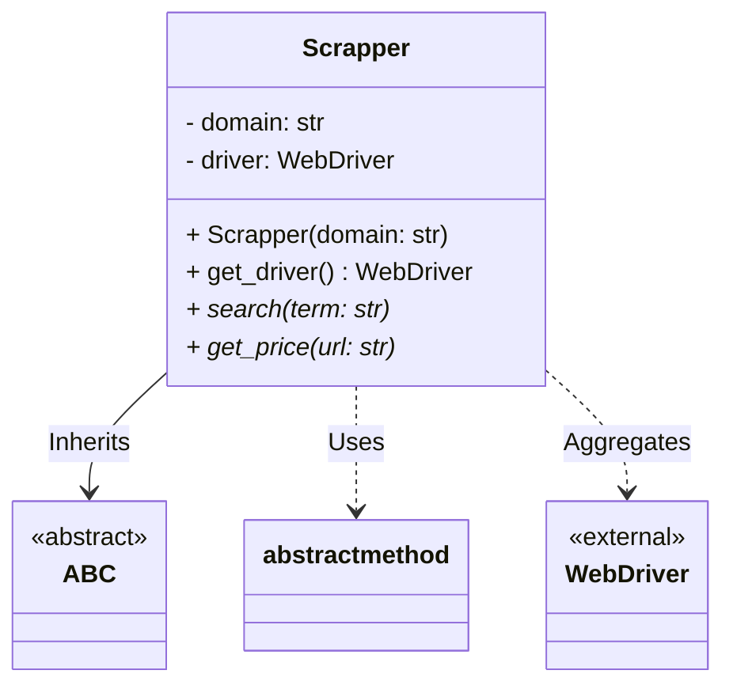
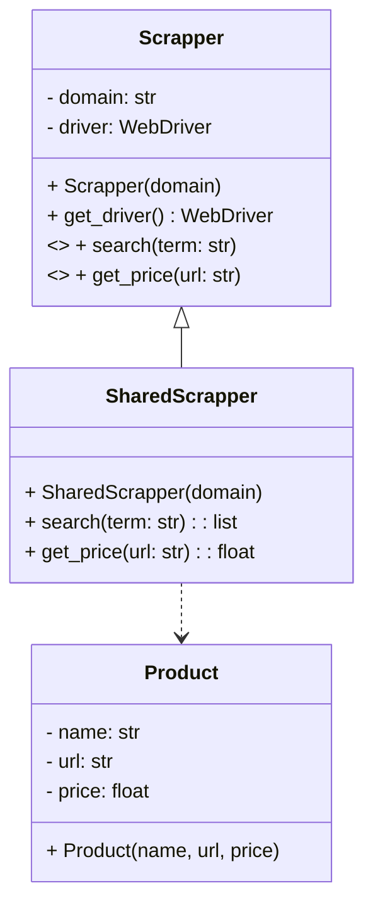

# prueba

```mermaid
classDiagram
    class Scrapper {
        - domain: str
        - driver: WebDriver
        + Scrapper(domain: str)
        + get_driver() WebDriver
        + search(term: str)*
        + get_price(url: str)*
    }
    class ABC {
        <<abstract>>
    }
    class abstractmethod {
    }

    Scrapper --> ABC : Inherits
    Scrapper ..> abstractmethod : Uses
    Scrapper ..> WebDriver : Aggregates

    class WebDriver {
        <<external>>
    }    
```

```mermaid

classDiagram
    class Scrapper {
        - domain: str
        - driver: WebDriver
        + Scrapper(domain)
        + get_driver() WebDriver
        <<abstract>> + search(term: str)
        <<abstract>> + get_price(url: str)
    }

    class SharedScrapper {
        + SharedScrapper(domain)
        + search(term: str): list
        + get_price(url: str): float
    }

    class Product {
        - name: str
        - url: str
        - price: float
        + Product(name, url, price)
    }

    Scrapper <|-- SharedScrapper
    SharedScrapper ..> Product
```
